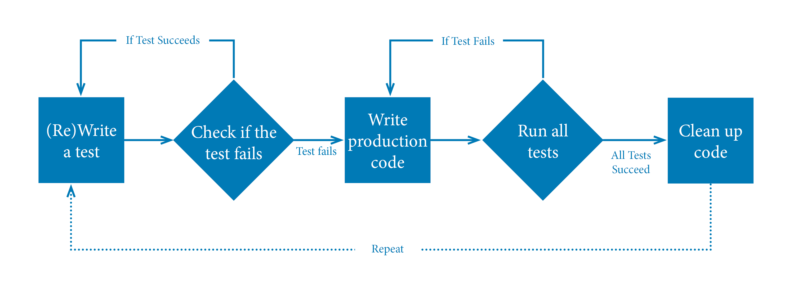

{
  "title":"Que es TDD tu primer ejercicio", 
  "date":"15-01-2024",
  "description":"",
  "topic":"XP",
  "toc":true
}


# ¿Qué es TDD?

TDD son las siglas de Test Driven Development y si lo traducimos, sería "Desarrollo Dirigido por Pruebas". Consiste en escribir primero el test, después el código que ponga en verde el test y por último, refactorizar el código para hacerlo más sencillo y comprensible. Además, es una práctica de XP (extreme programming), que es una metodológia de desarrollo que abarca desde la comunicación dentro del equipo hasta técnicas de programación.###

Los valores de XP:
1. Simplicidad
2. Comunicacións
3. Feedback
4. Respeto
5. Valor

En este post no se va a obtener toda la información ni los ejemplos para poder ejecutar de manera eficiente TDD. Para ello, recomiendo un libro de Carlos Blé en donde explica a fondo TDD.

### Pasos a seguir en un caso real:



#### El cliente nos pide que desarollemos un código que sea capaz de indicar si un número es primo o no y en caso de que el número sea 10, se devuelve un error:

- El cliente escribe la historia de usuario (indica las necesidades)

- El equipo de desarrollo junto al cliente escriben todos los posibles casos que pueden ocurrir
  - El número indicado es 10, devolver error
  - El número es primo
  - El número no es primo

- El equipo de desarrollo escoge el caso más simple y escribe una prueba unitaria

- Se comprueba que este test falla

- Se escribe el código que hace pasar el test

- Se ejecutan todos los tests

- Se refactoriza y se intenta dejar más simple el código

- Volver a pasar todos los tests para comprobar que no se ha roto nada.

- Pasamos al siguiente caso y volvemos a repetir desde el punto 4 hasta que terminemos el código.


Trabajar utilizando TDD ayuda a que entendamos mejor el código. Es importante que el conocimiento del equipo sobre el negocio para poder realizar un software de calidad

# Practicar a través de Katas

Son ejercicios sencillos que tienen como intención aprender, aplicar y mejorar técnicas de programación.

### Algunas katas que recomiendo son:
1. Fizz Buzz
2. String Calculator
3. Mars Rovers
4. Yatzy Kata (Aprender a refactorizar)

### Ventajas de utilizar TDD:
1. Código más robusto
2. Código más seguro
3. Código más mantenible
4. Mayor rapidez en el desarollo

### Desventajas de utilizar TDD:
1. **Hay que utilizarlo mucho y tener mucho conocimiento para llegar a ser productivo.**
2. **Bases de datos (repositorios)**. Cuando se desea hacer pruebas de código que traigan información de un repositorio, se utilizan MockObjects (objetos simulados) y aprender a utilizarlo requiere tiempo.  


# Aplicando TDD en el caso propuesto anteriormente

**Historia de usuario**: El cliente nos pide que desarollemos un código que sea capaz de indicar si un número es primo o no y en caso de que el número sea 10, se devuelve un error.

Casos de uso:   
  - El número indicado es 10, devolver error
  - El número es primo
  - El número no es primo (si sabemos que un numero es primo, ya sabremos si no es primo. Vamos a añadir un test igualmente para comprobarlo)


#### Red test: Número indicado es 10
``` typescript
it("throws error when number is 10", () => {
    expect(() => isPrimeNumber(10)).toThrowError("Invalid number");
});
```

#### Green test
``` typescript
function isPrimeNumber(number: number): boolean {
    if (number == 10) {
        throw new Error("Invalid number");
    }
    
    return false;
}
```

### Siguiente caso de uso: Es un número primo

#### Red test: isPrimeNumber is not defined
``` typescript
it("indicates true when number is prime", () => {
    const result = isPrimeNumber(3);

    expect(result).toBe(true);
});
```

#### Production code y green tests: 

``` typescript
function isPrimeNumber(number: number): boolean {
    if (number == 10) {
        throw new Error("Invalid number");
    }

    let isPrime = true;
    for (let i = 2; i < number; i++) {
        if (number % i == 0) {
            isPrime = false;
            break;
        }
    }

    if (isPrime) {
        return true;
    } else {
        return false;
    }
}
```

#### Refactor
``` typescript
function isPrimeNumber(number: number): boolean {
    if (number == 10) {
        throw new Error("Invalid number");
    }

    let isPrime = true;
    for (let i = 2; i < number; i++) {
        if (number % i == 0) {
            isPrime = false;
            break;
        }
    }

    return isPrime ? true : false;
}
```

#### Más refactors: 
``` typescript
function isPrimeNumber(number: number): boolean {
    if (number == 10) {
        throw new Error("Invalid number");
    }

    for (let i = 2; i < number; i++) {
        if (number % i == 0) {
            return false;
        }
    }

    return true;
}
```

### Último caso de uso: No es un número primo

#### Green test ( no hace falta añadir más código a la implementación que hay porque ya se sabe si no es primo al comprobar que es primo )
``` typescript
it("indicates false when number is not prime", () => {
    const result = isPrimeNumber(12);

    expect(result).toBe(false);
});
```